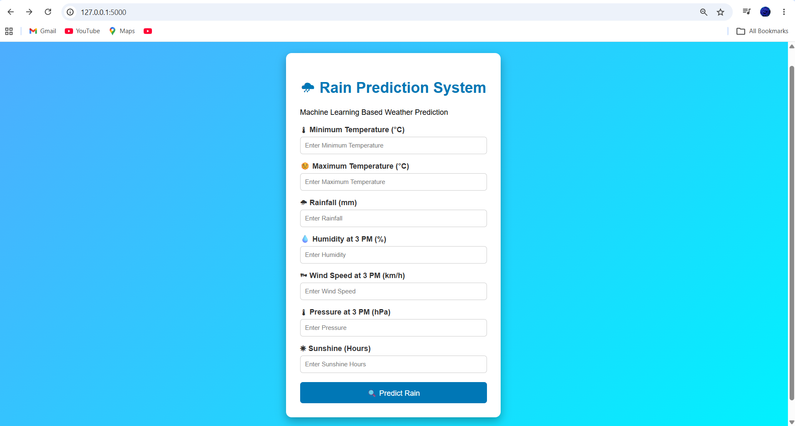
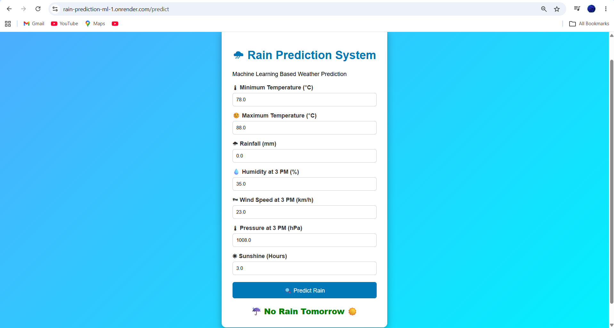

# 🌧️ Rain Prediction System using Machine Learning

A Machine Learning-based Rain Prediction System developed using **Python, Flask, and Logistic Regression**. This web application predicts whether it will rain based on seven weather parameters.

## 🌐 Live Demo

**Render Deployment:**  
https://rain-prediction-ml-1.onrender.com

---

## 📌 Project Overview

This project uses a trained Logistic Regression model to predict rainfall using weather conditions entered by the user through a Flask web interface.

The application accepts seven weather features and instantly predicts whether rain is expected.

---

## ✨ Features

- Predicts rain using Machine Learning
- User-friendly Flask web interface
- Uses 7 weather input features
- Fast prediction results
- Deployed online using Render
- Source code available on GitHub

---

## 🛠️ Technologies Used

- Python
- Flask
- Scikit-learn
- Pandas
- NumPy
- HTML
- CSS
- Joblib
- Render
- GitHub

---

## 📊 Machine Learning Model

- **Algorithm:** Logistic Regression
- **Dataset:** Australian Weather Dataset (archive.csv)
- **Training Accuracy:** **78.99%**

### Input Features

- Minimum Temperature (°C)
- Maximum Temperature (°C)
- Rainfall (mm)
- Humidity at 3 PM (%)
- Wind Speed at 3 PM (km/h)
- Pressure at 3 PM (hPa)
- Sunshine (hours)

### Output

- Rain Tomorrow: **Yes**
- Rain Tomorrow: **No**

---

## 🧪 Example Input

| Feature | Value |
|---------|------:|
| Minimum Temperature | 16.2 |
| Maximum Temperature | 24.8 |
| Rainfall | 2.4 |
| Humidity 3 PM | 72 |
| Wind Speed 3 PM | 20 |
| Pressure 3 PM | 1013.2 |
| Sunshine | 6.5 |

**Prediction:** Rain = Yes

---

## 📷 Project Screenshots

### Home Page



---

### Prediction Result



---

## 🚀 Installation

Clone the repository

```bash
git clone https://github.com/ANBU007-MCET/Rain-Prediction-ML.git
```

Go to project folder

```bash
cd Rain-Prediction-ML
```

Install dependencies

```bash
pip install -r requirements.txt
```

Run the application

```bash
python app.py
```

Open your browser

```
http://127.0.0.1:5000
```

---

## 📁 Project Structure

```
Rain-Prediction-ML/
│
├── static/
├── templates/
├── src/
├── app.py
├── archive.csv
├── Model_Training.ipynb
├── rain_prediction_model.pkl
├── requirements.txt
├── README.md
├── home.png.png
└── prediction.png.png
```

---

## 👨‍💻 Developer

**Anbu Selvan K**

GitHub:
https://github.com/ANBU007-MCET

---

## ⭐ Future Improvements

- Improve prediction accuracy
- Add more weather features
- Interactive charts
- Weather API integration
- Mobile responsive interface

---

## 📄 License

This project is created for educational and learning purposes.
